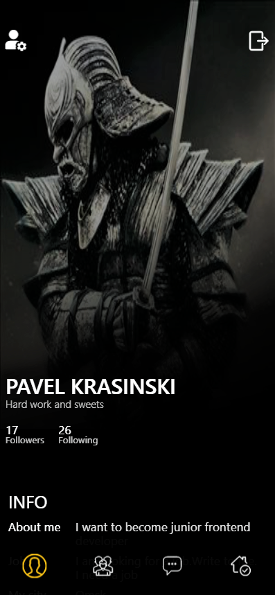

<h1 align="center">Social Network</h1>

<h2 align="center"><a  href="https://krasinskii-network.herokuapp.com/">Live Demo</a></h2>

## Description

This is an attempt to make our own mini-social network for React-developers.
Here you can find a job, chat and add friends of people you like. The main emphasis is on practicing practical skills with React-Hooks, REST API, Redux, Authorization The design of the site layout is made by yourself.

<div style={{display:flex;flexDirection:row}}>

</div>


## Technology

### REDUX

### CSS-Modules

### JSON-SERVER

### API(DataBase from https://social-network.samuraijs.com)

### AXIOS

###  REACT-FINAL-FORM

## Project setup

```
npm install
json-server --watch db.json
npm start 
